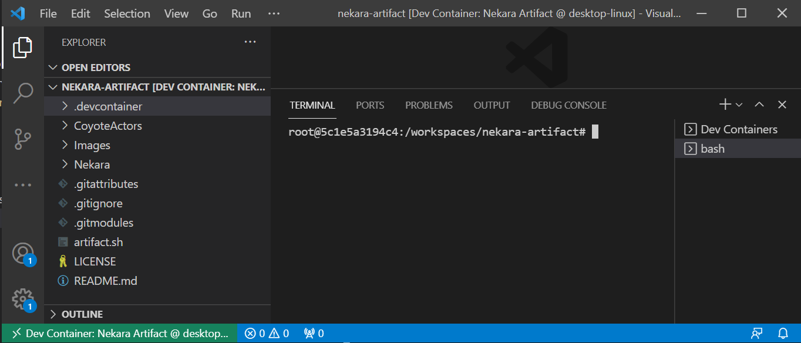

# Setting up and running the artifact

This documentation will guide you through setting up and running the artifact to reproduce
experiments from the paper.

## Setting up the artifact dev environment

### Installing and running Docker

To build the artifact, you first need to have Docker installed and running on your machine. This can
be done by downloading and installing [Docker
Desktop](https://www.docker.com/products/docker-desktop), which is available for Windows, Linux and
macOS.

**Note:** The artifact was tested with Docker version `20.10.7`, it will possibly work with some
earlier versions, but to be sure install the same Docker version (or a later one).

Next, run the Docker Desktop application to start Docker. You will know it's running if you look in
the activity tray and see the Docker whale icon. Docker might take a few minutes to start. If the
whale icon is animated, it is probably still in the process of starting. You can click on the icon
to see the status.


Once you have Docker installed and running, you can confirm that it is working by running the
following command on a **new** terminal:
```
docker --version
```

You should see something like the following output:
```
Docker version 20.10.7, build f0df350
```

### Installing VS Code

Now that you installed Docker, proceed to install the latest [VS
Code](https://code.visualstudio.com/), which is available for Windows, Linux and macOS. This can be
done [here](https://code.visualstudio.com/Download).

Next, install the `Remote - Containers` extension that lets you run Visual Studio Code inside a
Docker container. This can be done by clicking
[`vscode:extension/ms-vscode-remote.remote-containers`](vscode:extension/ms-vscode-remote.remote-containers)
(if you are unable to click the link, just copy paste it in your browser) which will open up the
extension in VS Code:


Click "Install" to install the extension.

### Building and opening the artifact in VS Code

Now you are ready to connect to the artifact container in VS Code by clicking this
[`vscode://ms-vscode-remote.remote-containers/cloneInVolume?url=https://github.com/pdeligia/nekara-artifact`](vscode://ms-vscode-remote.remote-containers/cloneInVolume?url=https://github.com/pdeligia/nekara-artifact)
(if you are unable to click the link, just copy paste it in your browser). This uses the "Open in VS
Code" feature of GitHub.

**Note:** If your browser asks you if you want to allow the website to open VS Code, select Open. If
VS Code asks you if you want to allow the extension to open the URI, then also select Open.

A new VS Code window will open (might take a few seconds) and the artifact container will start
automatically building using the [container configuration scripts](.devcontainer). You will be able
to see the build process on the VS Code terminal in the bottom right panel. During this time please
refrain from canceling the build process to make sure it completes successfully. This process can
take several minutes. Once it finishes, you should now be connected to the container.

You need to open a new `bash` terminal to be able to interact with the artifact. To do that select
`Terminal` on the top panel and then select `New Terminal` (or use the keyboard shortcut ``Ctrl +
Shift + ` ``). Your VS Code window should look like this (with an open terminal in the bottom right
panel):



Now you are ready to [run the artifact](#running-the-artifact)!

## Running the artifact

You can use the `artifact.sh` script (in the root directory) to run experiments.

You can find instructions below on how to run each experiment, and what results you should get. For
more details in what each experiment is doing, please read the corresponding section in the paper.

### Experiment #1: Memcached (Table III)

You can find the code for this experiment in the [Memcached](https://github.com/pdeligia/nekara-artifact/tree/main/Memcached) folder.

To run the experiments for finding bugs in Memcached using Nekara (see Table III in page 5 of
the paper) invoke the following command (which can take several minutes to complete) from the root
`nekara-artifact` directory:
```
bash artifact.sh memcached
```
**Note:** In the artifacts, we have only reproduced the Memcached Bugs that are non-trivial and likely to occur in the real-world scenerio.
In the paper, we have reproduced nine Memcached bugs (Table II), however, out of those, only three bugs are non-trivial and impactful. Using Nekara,
we could find four new bugs in Memcached and their detailed bug reports are available at: [Issue#738](https://github.com/memcached/memcached/issues/738),
[Issue#733](https://github.com/memcached/memcached/issues/733), [Issue#728](https://github.com/memcached/memcached/issues/728), and [Issue#741](https://github.com/memcached/memcached/issues/741).

### Experiment #2: Coyote (Table VI)

This experiment compares systematic testing on three versions of the [Coyote
Actors](https://microsoft.github.io/coyote/#concepts/actors/overview/) programming model (see Table
VI in page 9 of the paper):

- `Coyote` is the original version of Coyote, using its built-in systematic testing engine for
  running the experiments. The code for this version is [here](CoyoteActors/Framework/Coyote). The
  core of the systematic testing scheduling logic can be found in the
  [OperationScheduler.cs](CoyoteActors/Framework/Coyote/Source/TestingServices/Runtime/Scheduling/OperationScheduler.cs)
  file.

- `Coyote_N` is a version of Coyote instrumented directly with Nekara. The code for this version is
  [here](CoyoteActors/Framework/Coyote_N). You can find the Nekara instrumentation in the
  [OperationScheduler.cs](CoyoteActors/Framework/Coyote_N/Source/TestingServices/Runtime/Scheduling/OperationScheduler.cs)
  file, which contains the core systematic testing scheduling logic. Here you can also find all the
  imported (from C++ to C#, using P/Invoke) Nekara operations used throughout this file, for
  example:
  ```csharp
  [DllImport("libcoyote.so")]
  private static extern int create_operation(IntPtr scheduler, ulong operation_id);
  ```
  The rest of the Coyote code (outside this file) is mostly unmodified, showing how easy it was to
  replace the original systematic testing of Coyote with Nekara.

- `TPL_N` is a version of Coyote where the underlying task-based code of the Coyote runtime is
  instrumented by Nekara using a drop-in-replacement version of the [Task Parallel
  Library](https://docs.microsoft.com/en-us/dotnet/standard/parallel-programming/task-parallel-library-tpl)
  of C#. The code for this version is [here](CoyoteActors/Framework/TPL_N).

You can also find the code for each benchmark (`ChainReplication`, `FailureDetector`, `Paxos` and
`Raft`) in [this](CoyoteActors/Benchmarks) directory. To streamline the experiment there are 3
copies of each benchmark, one for each of the above three versions of Coyote. Each version contains
a `Driver.cs` file with the entry point to the benchmark using the corresponding version of Coyote.

You can read more details about the experiment, the three Coyote versions, and the results in
Section VII-a of the paper.

To run the experiments invoke the following command (which can take several minutes to complete,
depending on your machine) from the root `nekara-artifact` directory:
```
bash artifact.sh coyote 10000
```

**Note:** If the above command is taking too long on your machine, you can reduce the test
iterations (i.e. runs) by changing the `10000` value to a smaller value such as `100` or `1000`.
This will complete the experiments much faster, but if you run less than the `10000` test iterations
that were used in the paper then it is very likely that the bug-finding ability of Nekara or Coyote
might regress for some benchmarks (e.g. if a bug is found 1/10000 times, it might not be found
unless you run the experiment more times). This is normal and expected due to concurrency/scheduling
nondeterminism.

The results from running the above command can be found in the `CoyoteActors/Results` directory.
There you will see multiple JSON files, one for each experiment. Each JSON file is named as
`benchmark_target` where benchmark is a benchmark name from TABLE VI (for example
`ChainReplication`) and target is one of `Coyote`, `Coyote_N` and `TPL_N` (the last two are
instrumented with Nekara, as explained in the paper).

For example, you will see the following JSON file:
```json
// chainreplication_coyote.json
{"BuggyIterations":0.0001,"Time":375190.2749}
```

The name of the file corresponds to the `ChainReplication` benchmark run and the `Coyote` target.
The JSON contents are the following:
- `BuggyIterations`, which is the % of the iterations (i.e. runs) that were buggy, in this case out
  of `10000` test iterations, Coyote uncovered the bug once in the benchmark.
- `Time`, which is the time in seconds it took to to run all the iterations in the benchmark.

**Note:** due to nondeterminism in the concurrent execution, as well as variations in the underlying
OS scheduler and machine that Docker is running, some variation in the results from the paper is
totally normal and expected. However, the overall trend should be similar to the paper, and this is
what running these experiments showcases.

### Experiment #3: Maple (Table VII)

You can find the code for this experiment in the [Maple](https://github.com/pdeligia/nekara-artifact/tree/main/Maple) folder.

To run the experiments for reproducing bugs found by Maple (see Table VII in page 10 of the paper)
invoke the following command (which can take several minutes to complete) from the root
`nekara-artifact` directory:
```
bash artifact.sh maple
```

**Note:** Some of the Maple benchmarks, like Memcached, consumes a large amount of time and memory for 10K
iterations. So, we have reduced the number of test iterations to 100 by default in our scripts. You can increase the number of iterations by simply editing the artifact.sh script. The results presented in the paper were obtained by running 10K test iterations, and so, the observed results, with 100 iterations, might be slightly off than those reported in the paper.

### Experiment #4: TSVD (Table VII)

**Note:** As discussed in [README.md](README.md), this experiment is marked **optional** for the
purposes of this artifact, because it is **Windows-only** and thus cannot be build or run inside the
artifact's Ubuntu 18.04 Docker container.

However, we still provide the source code for the benchmarks and scripts for the experiments, for
artifact users who might have access to a Windows machine with the .NET Framework v4.6 installed.

Assumming you have access to such Windows environment, to build the benchmarks, open the following
solution files (`.sln`) using the [Visual Studio 19](https://visualstudio.microsoft.com/) IDE and
select "Build Solution". You might require support for .NET4.8 and .NET5.0 on your machine:
- [DateTimeExtensions.sln](TSVD/DateTimeExtensions/DateTimeExtensions.sln)
- [Radical.sln](TSVD/Radical/Radical.sln)
- [System.Linq.Dynamic.sln](TSVD/System.Linq.Dynamic/Src/System.Linq.Dynamic.sln)
- [Thunderstruck.sln](TSVD/Thunderstruck/Thunderstruck.sln)
- [kubernetes-client.sln](TSVD/kubernetes-client/kubernetes-client.sln)
- [FluentAssertions.sln](TSVD/fluentassertions/FluentAssertions.sln)

You can find the further details at [TSVD/README.md](TSVD/README.md).

## Troubleshooting

### Issue authenticating to Docker
It is unlikely, but if opening the GitHub repository on a VS Code Docker container fails with a
Docker authentication error, then you can fix this by logging in your Docker account (please create
one, if you do not have one already). You can either login using the Docker Desktop GUI or by
running the following command from your terminal (which will ask for your username and password):
```bash
docker login
# Login Succeeded
```

### The device run out of memory
If you get an error that the device run out of memory while building the Docker container after
opening the GitHub repository in VS Code, then it is likely that you can fix this by clearing up
Docker images and your Docker cache. You can do this by running:
```bash
docker system prune
docker images
docker rmi $IMAGE_ID
```
