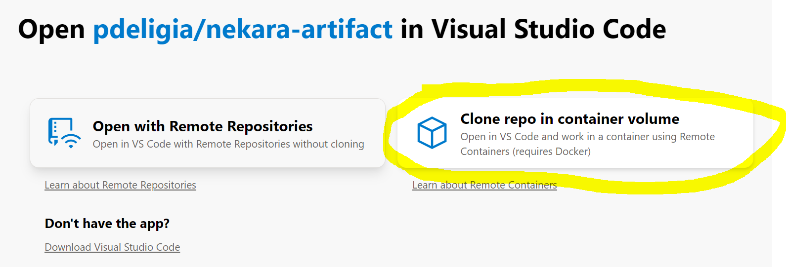
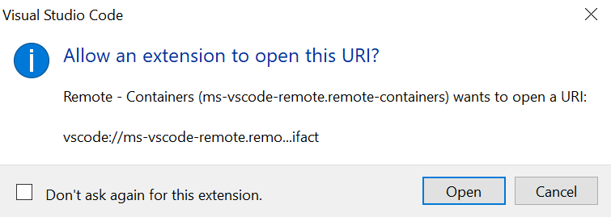
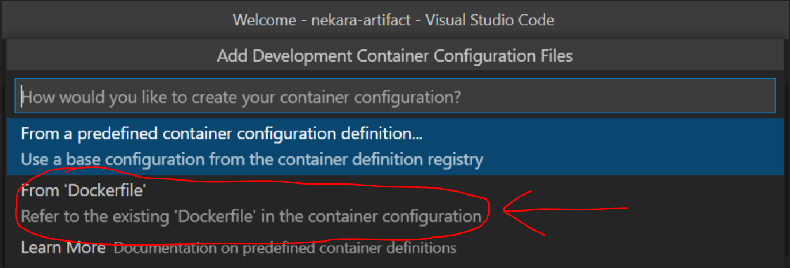
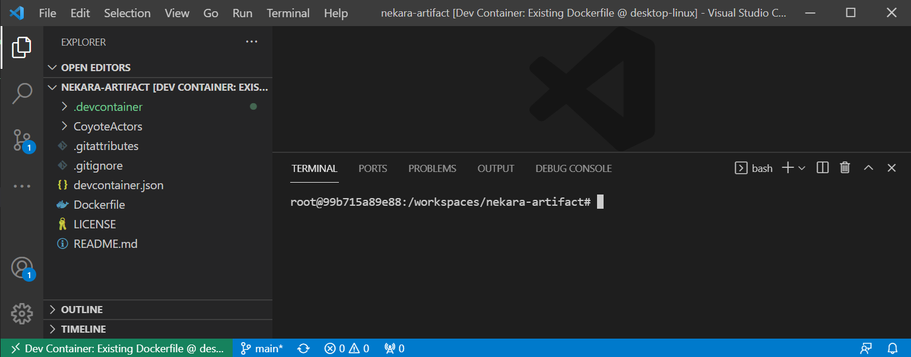

# Nekara: Generalized Concurrency Testing (Artifact)

This repository contains the artifact for the "Nekara: Generalized Concurrency Testing" paper that
was accepted in ASE 2021.

The artifact is packaged as a Docker image that runs Ubuntu 18.04. It uses the "Open in VS Code"
feature of GitHub that allows GitHub repositories to easily open in VS Code using a Docker
container. This allows you to both run experiments, but also edit the artifact code, on a pre-setup
dev environment with ease from your local machine. We will guide you through the process of setting
this up for your machine [here](#prerequisites).

## Setting up the dev environment

### Installing and running Docker

To build the artifact, you first need to have Docker installed and running on your machine. This can
be done by downloading and installing [Docker
Desktop](https://www.docker.com/products/docker-desktop), which is available for Windows, Linux and
macOS.

**Note:** The artifact was tested with Docker version `20.10.7`, it will possibly work with some
earlier versions, but to be sure install the same Docker version that we did (or a later one).

Next, run the Docker Desktop application to start Docker. You will know it's running if you look in
the activity tray and see the Docker whale icon. Docker might take a few minutes to start. If the
whale icon is animated, it is probably still in the process of starting. You can click on the icon
to see the status.


Once you have Docker installed and running, you can confirm that it is working by running the
following command on a **new** terminal:
```
docker --version
```

You should see something like the following output:
```
Docker version 20.10.7, build f0df350
```

Before proceeding to the build instructions, make sure to login to your Docker account, which is
required by Docker to authenticate and build images. Please create a new Docker account if you do
not have one already. You can either login using the Docker Desktop GUI or by running the following
command from your terminal (which will ask for your username and password):
```
docker login
```

You should see the following output:
```
Login Succeeded
```

### Installing VS Code and required extensions

Now that you installed Docker, proceed to install the latest [VS
Code](https://code.visualstudio.com/), which is available for Windows, Linux and macOS. This can be
done [here](https://code.visualstudio.com/Download).

Next, install the "Remote - Containers" extension that lets you run Visual Studio Code inside a
Docker container. This can be done by clicking
[here](vscode:extension/ms-vscode-remote.remote-containers) which will open up the extension in VS
Code.


With the "Remote - Containers" extension installed, you will see a new status bar item at the far left.


Next, connect to the Docker container in VS Code by using this
[link](https://open.vscode.dev/pdeligia/nekara-artifact) and selecting the "Clone repo in container
volume" option (see highlighted button on the right side in the image below).



If your browser asks you to allow the site to open VS Code, press allow or open. Next, VS Code will
ask you if you allow the extension to open the URI, press Open. It can take several minutes to build
the Docker container before it connects to it.



VS Code will ask you how to create your container configuration. Select `From 'DockerFile'` (second
option) as in the following image:



You should now be connected to the container and able to see the workspace as in the following image:



**Note:** If the bash terminal in the lower right panel does not appear, then select `Terminal` on the top panel and then select `New Terminal` (or use the keyboard shortcut ``Ctrl + Shift + ` ``).

Now you are ready to [run the artifact](#running-the-artifact)!

## Running the artifact

To build the artifact, run the following command (which might take a few minutes to complete) from
the root `nekara-artifact` directory:
```
bash build.sh
docker image build . -t nekara-artifact:build
```
