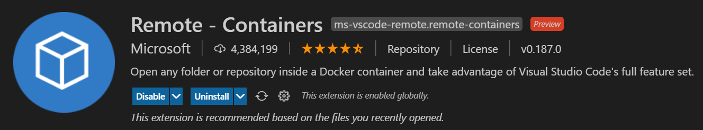

# Nekara: Generalized Concurrency Testing (Artifact)

This repository contains the artifact accompanying the ASE 2021 paper "Nekara: Generalized
Concurrency Testing".

## Overview of the artifact

This artifact includes code and scripts for building and running the following **4 non-proprietary
experiments** from the paper:
- Finding bugs with Nekara in [Memcached](https://www.memcached.org/) (see Table II in page 5).
- Comparison of systematic testing with Nekara against [Coyote](https://github.com/microsoft/Coyote)
  on the [Coyote Actors](https://microsoft.github.io/coyote/#concepts/actors/overview/) programming
  model (see Table VI in page 9).
- Reproducing bugs found by [TSVD](https://github.com/microsoft/TSVD) (see Table VII in page 10).
- Reproducing bugs found by [Maple](http://web.eecs.umich.edu/~nsatish/papers/OOPSLA-12-Maple.pdf)
  (see Table VII in page 10).

**Note:** The following 3 experiments from the paper were not included because they require (1)
proprietary Microsoft-internal systems in the case of the CSCS and ECSS, and (2) an earlier internal
branch of [Verona](https://github.com/microsoft/verona) (i.e. Zevio in the anonymized version of the
paper) that has not been open-sourced yet.

**Optional:** [Nekara](https://github.com/microsoft/coyote-scheduler), which is open sourced under
the name `coyote-scheduler`, can be used stand-alone outside the scope of this artifact. To do so,
clone its [repository](https://github.com/microsoft/coyote-scheduler) and follow the build
instructions in the repository README.md. You can find small examples of how to use Nekara for
instrumenting C++ code
[here](https://github.com/microsoft/coyote-scheduler/tree/main/test/integration).

## Setting up the artifact dev environment

The artifact is packaged as a Docker image that runs Ubuntu 18.04. It uses the "Open in VS Code"
feature of GitHub that allows GitHub repositories to easily open in VS Code using a Docker
container. This allows you to both run experiments, but also edit the artifact code, on a pre-setup
dev environment with ease from your local machine. We will guide you through the process of setting
this up for your machine [here](#prerequisites).

### Installing and running Docker

To build the artifact, you first need to have Docker installed and running on your machine. This can
be done by downloading and installing [Docker
Desktop](https://www.docker.com/products/docker-desktop), which is available for Windows, Linux and
macOS.

**Note:** The artifact was tested with Docker version `20.10.7`, it will possibly work with some
earlier versions, but to be sure install the same Docker version that we did (or a later one).

Next, run the Docker Desktop application to start Docker. You will know it's running if you look in
the activity tray and see the Docker whale icon. Docker might take a few minutes to start. If the
whale icon is animated, it is probably still in the process of starting. You can click on the icon
to see the status.


Once you have Docker installed and running, you can confirm that it is working by running the
following command on a **new** terminal:
```
docker --version
```

You should see something like the following output:
```
Docker version 20.10.7, build f0df350
```

### Installing VS Code and required extension

Now that you installed Docker, proceed to install the latest [VS
Code](https://code.visualstudio.com/), which is available for Windows, Linux and macOS. This can be
done [here](https://code.visualstudio.com/Download).

Next, install the "Remote - Containers" extension that lets you run Visual Studio Code inside a
Docker container. This can be done by clicking
[here](vscode:extension/ms-vscode-remote.remote-containers) which will open up the extension in VS
Code.



### Opening the artifact in VS Code

Next, connect to the Docker container in VS Code by using this
[link](https://open.vscode.dev/pdeligia/nekara-artifact) and selecting the "Clone repo in container
volume" option (see highlighted button on the right side in the image below).


**Note:** If your browser asks you if you want to allow the website to open VS Code, press allow or open.
Next, if VS Code asks you if you want to allow the extension to open the URI, then press Open again.

VS Code will ask you how to create your container configuration. Select `From 'DockerFile'` (second
option) as in the following image:


It can take several minutes to build the Docker container before it connects to it.

Once it finishes, you should now be connected to the container and able to see the workspace and an
open terminal:


**Note:** If the bash terminal in the lower right panel does not appear, then select `Terminal` on
the top panel and then select `New Terminal` (or use the keyboard shortcut ``Ctrl + Shift + ` ``).

Now you are ready to [run the artifact](#running-the-artifact)!

## Running the artifact

To build the artifact, run the following command (which can take several minutes to complete) from
the root `nekara-artifact` directory:
```
bash artifact.sh build
```

The script will first build [Nekara](https://github.com/microsoft/coyote-scheduler), which is open
sourced under the name `coyote-scheduler`, and then builds the non-proprietary benchmarks from the
paper.

Below we will give instructions on how to run each experiment, and what results you should get. For
more details in what each experiment is doing, please read the corresponding section in the paper.

### Experiment #1: Memcached (Table II)

You can find the code for this experiment ...

To run the experiments for finding bugs in Memcached using Nekara (see Table II in page 5 of the
paper) invoke the following command (which can take several minutes to complete) from the root
`nekara-artifact` directory:
```
bash artifact.sh run memcached
```

### Experiment #2: Coyote (Table VI)

This experiment compares systematic testing on three versions of the [Coyote
Actors](https://microsoft.github.io/coyote/#concepts/actors/overview/) programming model (see Table
VI in page 9 of the paper):

- `Coyote` is the original version of Coyote, using its built-in systematic testing engine for
  running the experiments. The code for this version is [here](CoyoteActors/Framework/Coyote). The
  core of the systematic testing scheduling logic can be found in the
  [OperationScheduler.cs](CoyoteActors/Framework/Coyote/Source/TestingServices/Runtime/Scheduling/OperationScheduler.cs)
  file.

- `Coyote_N` is a version of Coyote instrumented directly with Nekara. The code for this version is
  [here](CoyoteActors/Framework/Coyote_N). You can find the Nekara instrumentation in the
  [OperationScheduler.cs](CoyoteActors/Framework/Coyote_N/Source/TestingServices/Runtime/Scheduling/OperationScheduler.cs)
  file, which contains the core systematic testing scheduling logic. Here you can also find all the
  imported (from C++ to C#, using P/Invoke) Nekara operations used throughout this file, for
  example:
  ```csharp
  [DllImport("libcoyote.so")]
  private static extern int create_operation(IntPtr scheduler, ulong operation_id);
  ```
  The rest of the Coyote code (outside this file) is mostly unmodified, showing how easy it was to
  replace the original systematic testing of Coyote with Nekara.

- `TPL_N` is a version of Coyote where the underlying task-based code of the Coyote runtime is
  instrumented by Nekara using a drop-in-replacement version of the [Task Parallel
  Library](https://docs.microsoft.com/en-us/dotnet/standard/parallel-programming/task-parallel-library-tpl)
  of C#. The code for this version is [here](CoyoteActors/Framework/TPL_N).

You can also find the code for each benchmark (`ChainReplication`, `FailureDetector`, `Paxos` and
`Raft`) in [this](CoyoteActors/Benchmarks) directory. To streamline the experiment there are 3
copies of each benchmark, one for each of the above three versions of Coyote. Each version contains
a `Driver.cs` file with the entry point to the benchmark using the corresponding version of Coyote.

You can read more details about the experiment, the three Coyote versions, and the results that we
got in Section VII-a of the paper.

To run the experiments invoke the following command (which can take several hours to complete,
depending on your machine) from the root `nekara-artifact` directory:
```
bash artifact.sh run coyote 10000
```

**Note:** If the above command is taking too long on your machine, you can reduce the test
iterations (i.e. runs) by changing the `10000` value to a smaller value such as `100` or `1000`.
This will complete the experiments much faster, but if you run less than the `10000` test iterations
than we run for the paper experiments then it is very likely that the bug-finding ability of Nekara
or Coyote might regress for some benchmarks (e.g. if a bug is found 1/10000 times, it might not be
found unless you run the experiment more times). This is normal and expected due to
concurrency/scheduling nondeterminism.

The results from running the above command can be found in the `CoyoteActors/Results` directory.
There you will see multiple JSON files, one for each experiment. Each JSON file is named as
`benchmark_target` where benchmark is a benchmark name from TABLE VI (for example
`ChainReplication`) and target is one of `Coyote`, `Coyote_N` and `TPL_N` (the last two are
instrumented with Nekara, as explained in the paper).

For example, you will see the following JSON file:
```json
// chainreplication_coyote.json
{"BuggyIterations":0.0001,"Time":375190.2749}
```

The name of the file corresponds to the `ChainReplication` benchmark run and the `Coyote` target.
The JSON contents are the following:
- `BuggyIterations`, which is the % of the iterations (i.e. runs) that were buggy, in this case out
  of `10000` test iterations, Coyote uncovered the bug once in the benchmark.
- `Time`, which is the time in seconds it took to to run all the iterations in the benchmark.

**Note:** due to nondeterminism in the concurrent execution, as well as variations in the underlying
OS scheduler and machine that Docker is running, some variation in the results from the paper is
totally normal and expected. However, the overall trend should be similar to the paper, and this is
what running these experiments showcases.

### Experiment #3: TSVD (Table VII)

You can find the code for this experiment ...

To run the experiments for reproducing bugs found by TSVD (see Table VII in page 10 of the paper)
invoke the following command (which can take several minutes to complete) from the root
`nekara-artifact` directory:
```
bash artifact.sh run tsvd
```

### Experiment #4: Maple (Table VII)

You can find the code for this experiment ...

To run the experiments for reproducing bugs found by Maple (see Table VII in page 10 of the paper)
invoke the following command (which can take several minutes to complete) from the root
`nekara-artifact` directory:
```
bash artifact.sh run maple
```

## Troubleshooting

### Issue authenticating to Docker
It is unlikely, but if opening the GitHub repository on a VS Code Docker container fails with a
Docker authentication error, then you can fix this by logging in your Docker account (please create
one, if you do not have one already). You can either login using the Docker Desktop GUI or by
running the following command from your terminal (which will ask for your username and password):
```bash
docker login
# Login Succeeded
```

### The device run out of memory
If you get an error that the device run out of memory while building the Docker container after opening the GitHub repository in VS Code, then it is likely that you can fix this by clearing up Docker images and your Docker cache. You can do this by running:
```bash
docker system prune
docker images
docker rmi $IMAGE_ID
```
